# CXR Image Classification.ipynb

This Jupyter Notebook implements an end-to-end pipeline for classifying chest X-ray images into four categories: **Covid**, **Normal**, **Pneumonia**, and **Tuberculosis**. It covers data splitting, exploration, preprocessing, model design, training, evaluation, and saving the best model.

## Setup and Dependencies  
Imports key libraries for image processing, data handling, visualization, and deep learning:
```python
import os
import cv2
import random
import shutil
import pandas as pd
import numpy as np
import matplotlib.pyplot as plt
import seaborn as sns
from itertools import cycle
from sklearn.utils import shuffle
from sklearn.model_selection import train_test_split
from sklearn.metrics import confusion_matrix, classification_report
import tensorflow as tf
from tensorflow import keras
from tensorflow.keras.preprocessing.image import ImageDataGenerator
from tensorflow.keras.callbacks import EarlyStopping, ModelCheckpoint
from tensorflow.keras.layers import Conv2D, MaxPooling2D, BatchNormalization, Flatten, Dense, Dropout
```


## Data Loading and Splitting  
Organizes a raw dataset into **train**, **validation**, and **test** folders for each class using an 80/10/10 split:  
- Defines original and output directories  
- Creates class subdirectories  
- Copies images into train/val/test sets  
- Prints counts per split  
```python
# Paths & ratios
orginial_folder = r"C:\Data\CXR dataset"
out_dir = r"C:\Data\split_data"
train_dir, val_dir, test_dir = [os.path.join(out_dir, d) for d in ['train','validation','test']]
classes = ['Covid','Normal','Pneumonia','Tuberculosis']
test_size, val_size = 0.1, 0.1

# Create folders & split
os.makedirs(train_dir, exist_ok=True)
...
for cls in classes:
    images = [f for f in os.listdir(scr_dir) if f.lower().endswith((".png",".jpg"))]
    train_val, test = train_test_split(images, test_size=test_size, random_state=42)
    val_ratio = val_size/(1-test_size)
    train, val = train_test_split(train_val, test_size=val_ratio, random_state=42)
    # copy files...
    print(f"{cls}: Total={len(images)}, Train={len(train)}, Validation={len(val)}, Test={len(test)}")
```


## Data Exploration  
Displays a round-robin sample of 16 images (one per class in turn) to visualize class variety:  
- Lists subfolders  
- Collects image paths per class  
- Selects images in a cycle  
- Plots a 4×4 grid with titles  
```python
main_folder = train_dir
subfolders = os.listdir(main_folder)
folder_images = {f: sorted(os.listdir(os.path.join(main_folder,f))) for f in subfolders}
selected = []
cycle_folders = cycle(subfolders)
while len(selected) < 16:
    folder = next(cycle_folders)
    if folder_images[folder]:
        selected.append(folder_images[folder].pop())
# Plot grid...
```


## Preprocessing & Data Augmentation  
Normalizes pixel values and sets up generators for each split:  
- Defines `image_size = 244`, `BATCH_SIZE = 32`  
- Preprocessing: scale to [0,1]  
- Uses `ImageDataGenerator` for train/val/test without geometric augmentations  
```python
def preprocess(x): return x/255.0

train_gen = ImageDataGenerator(preprocessing_function=preprocess).flow_from_directory(
    train_dir, target_size=(image_size,image_size), batch_size=BATCH_SIZE, class_mode='categorical')
val_gen = ImageDataGenerator(preprocessing_function=preprocess).flow_from_directory(...)
test_gen = ImageDataGenerator(preprocessing_function=preprocess).flow_from_directory(...)
```


## Model Architecture  
Builds a deep CNN with three convolutional blocks, dropout, and dense layers:
```python
cnn_model = keras.Sequential([
    keras.layers.Input(shape=(244,244,3)),
    Conv2D(64, (3,3), activation='relu'),
    MaxPooling2D((2,2)),
    Conv2D(64, (3,3), activation='relu'),
    MaxPooling2D((2,2)),
    Conv2D(128,(3,3),activation='relu'),
    MaxPooling2D((2,2)),
    Flatten(),
    Dropout(0.4),
    Dense(120, activation='relu'),
    Dense(120, activation='relu'),
    Dense(120, activation='relu'),
    Dense(4, activation='softmax')
])
```




```mermaid
flowchart LR
    Input[Input 244×244×3]
    Conv1[Conv2D 64 filters]
    Pool1[MaxPool 2×2]
    Conv2[Conv2D 64 filters]
    Pool2[MaxPool 2×2]
    Conv3[Conv2D 128 filters]
    Pool3[MaxPool 2×2]
    Flatten[Flatten]
    Dropout[Dropout 0.4]
    Dense1[Dense 120]
    Dense2[Dense 120]
    Dense3[Dense 120]
    Output[Softmax 4]

    Input --> Conv1 --> Pool1 --> Conv2 --> Pool2 --> Conv3 --> Pool3 --> Flatten --> Dropout --> Dense1 --> Dense2 --> Dense3 --> Output
```

## Compilation and Training  
Compiles with Adam optimizer, categorical crossentropy, and monitors multiple metrics. Uses callbacks to prevent overfitting and save the best model:
```python
cnn_model.compile(
    optimizer=keras.optimizers.Adam(),
    loss=keras.losses.CategoricalCrossentropy(),
    metrics=['accuracy', keras.metrics.Precision(name='precision'), keras.metrics.Recall(name='recall')]
)

callbacks = [
    EarlyStopping(monitor='val_loss', patience=5, restore_best_weights=True),
    ModelCheckpoint('CNN_best_model.keras', monitor='val_loss', save_best_only=True, mode='min'),
    keras.callbacks.ReduceLROnPlateau(monitor='val_loss', factor=0.5, patience=3)
]
history = cnn_model.fit(train_gen, validation_data=val_gen, epochs=20, callbacks=callbacks)
```


## Performance Visualization  
Plots training & validation loss and accuracy over epochs to inspect learning behavior:
```python
plt.figure()
plt.plot(history.history['accuracy'], label='train_accuracy')
plt.plot(history.history['val_accuracy'], label='val_accuracy')
plt.title('Accuracy over Epochs')
plt.xlabel('Epoch')
plt.ylabel('Accuracy')
plt.legend()
plt.show()
```

## Evaluation on Test Set  
Generates predictions on the test generator, then computes and displays:  
- A **confusion matrix**  
- A **classification report** with precision, recall, f1-score per class  
```python
y_pred = cnn_model.predict(test_gen)
y_true = test_gen.classes
y_pred_classes = np.argmax(y_pred, axis=1)

cm = confusion_matrix(y_true, y_pred_classes)
print(cm)

report = classification_report(y_true, y_pred_classes, target_names=list(test_gen.class_indices))
print(report)
```

## Saving and Loading the Best Model  
The best checkpoint is saved automatically as `CNN_best_model.keras`. You can load it later via:
```python
best_model = keras.models.load_model('CNN_best_model.keras')
```


## Relationships to Other Files  
- **Dataset Folder**: Expects a raw dataset under `CXR dataset/` with subfolders for each class.  
- **Saved Model**: Outputs `CNN_best_model.keras` for inference or further fine-tuning.  
- **No External Modules**: All code resides in this notebook; it does not depend on other scripts in the repository.