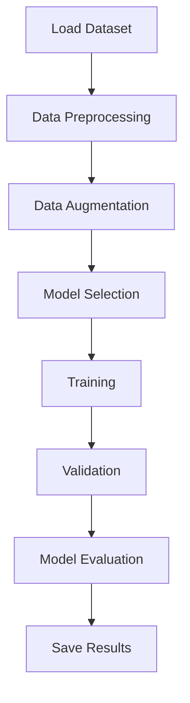

# CXR Image Classification

## Introduction

CXR Image Classification is a deep learning repository designed to classify chest X-ray (CXR) images for medical diagnostics. The project leverages advanced convolutional neural networks and transfer learning techniques to identify anomalies and diseases in CXR scans, supporting automated medical image analysis. This repository aims to aid researchers and healthcare professionals in developing robust CXR classification pipelines.

## Usage

To use this repository, clone it to your local machine and set up the required environment. The primary workflow involves preparing the dataset, configuring the model, and running the training or evaluation scripts. Detailed instructions and example commands are available in the project documentation.

Typical usage includes the following steps:
- Clone the repository:
  ```bash
  git clone https://github.com/ShroffFawaz/CXR-image-classification.git
  cd CXR-image-classification
  ```
- Install the dependencies:
  ```bash
  pip install -r requirements.txt
  ```
- Prepare your dataset in the required format.
- Run training or evaluation scripts as described in the documentation.

## Configuration

The repository supports flexible configuration to adapt to different datasets and model parameters. Key configuration options include:
- Dataset paths and formats
- Model architecture selection (e.g., ResNet, DenseNet)
- Hyperparameters: learning rate, batch size, epochs
- Data augmentation settings
- Output paths for model checkpoints and logs

Configuration is typically managed via a YAML or JSON file, or through command-line arguments. Review the configuration templates provided and adjust them according to your needs.

## Contributing

Contributions are welcome and encouraged! To contribute:
- Fork the repository and create a new branch for your feature or bug fix.
- Adhere to the existing code style and best practices.
- Write clear commit messages and document your changes.
- Submit a pull request describing your updates and improvements.

Before submitting, ensure your code passes all tests and does not break existing functionality. For major changes, please open an issue to discuss your proposal first.

## Requirements

Before running the code, make sure your environment meets the following requirements:
- Python (version specified in requirements.txt)
- PyTorch or TensorFlow (as specified)
- CUDA (for GPU support, optional)
- Necessary Python libraries (install via requirements.txt)
- Adequate computational resources for training deep learning models

Refer to the `requirements.txt` for a complete list of dependencies and install them using pip.

## Features

The CXR Image Classification repository offers the following features:
- State-of-the-art deep learning models for chest X-ray classification
- Transfer learning with pre-trained networks
- Customizable data augmentation and preprocessing pipelines
- Training, validation, and test scripts with metrics reporting
- Support for multiple datasets and flexible input formats
- Model checkpointing and logging for experiment management
- Easy extensibility for new models or datasets

### Architecture Overview

Below is a high-level diagram of the typical workflow:



This pipeline ensures efficient processing from raw images to final classification results, enabling users to focus on model improvement and analysis.

---

For more information, detailed documentation, and examples, please refer to the repository files and code comments.
